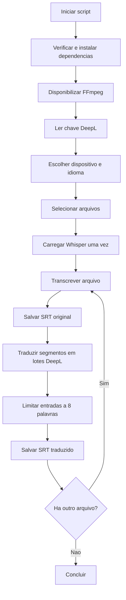

# Guia de manutencao

Este documento descreve a implementacao atual do gerador de SRT, suas decisoes de projeto e os pontos que exigem cuidado em alteracoes futuras.

## Visao geral

O projeto recebe um ou mais arquivos de audio/video, transcreve o audio com OpenAI Whisper, salva uma legenda no idioma original e traduz os segmentos pela API DeepL Cloud. Os dois arquivos SRT sao gravados na mesma pasta da midia.

Para um arquivo `video.mp4`, as saidas padrao sao:

- `video_sem_traducao.srt`: transcricao original do Whisper.
- `video.srt`: versao traduzida pelo DeepL.

Cada entrada SRT possui no maximo oito palavras. Segmentos maiores sao transformados em entradas independentes, nunca em duas linhas dentro da mesma entrada.

## Arquivos do repositorio

- `gerar_srt.py`: aplicacao, interface de terminal e integracoes externas.
- `executar_para_selecionar_videos.bat`: inicia o script com o Python disponivel no `PATH`.
- `config.json`: configuracao versionada da chave DeepL.
- `test_gerar_srt.py`: testes unitarios sem consumo real da API DeepL.
- `README.md`: instrucoes para uso cotidiano.
- `docs/MAINTENANCE.md`: arquitetura e orientacoes de manutencao.

## Fluxo de execucao



### 1. Preparacao

`ensure_dependencies()` importa as dependencias e instala automaticamente as ausentes via `python -m pip`:

- `openai-whisper`
- `imageio-ffmpeg`
- `requests`
- `rich`

`ensure_ffmpeg()` procura `ffmpeg` no `PATH`. Quando nao encontra, usa o binario fornecido por `imageio-ffmpeg` e adiciona sua pasta ao `PATH` apenas na execucao atual.

### 2. Chave DeepL

`get_deepl_api_key()` usa esta ordem de prioridade:

1. Campo `deepl_api_key` de `config.json`, ao lado do script.
2. Variavel de ambiente `DEEPL_API_KEY`.
3. Entrada oculta no terminal por `getpass`.

O `config.json` e intencionalmente versionado por decisao do proprietario. Isso significa que qualquer chave gravada nele fica no historico Git, mesmo se for removida depois. Em caso de publicacao acidental, a chave deve ser revogada no painel DeepL; apagar apenas o arquivo nao elimina o segredo do historico.

### 3. Dispositivo de transcricao

O menu permite CUDA ou CPU. `get_runtime_device()` confirma se CUDA esta realmente disponivel.

Quando CUDA e solicitada e existe uma GPU NVIDIA, `ensure_torch_cuda()` tenta garantir um PyTorch com CUDA. Se o PyTorch atual for CPU-only, tenta reinstalar pelas fontes `cu124` e `cu121` e reinicia o script. A variavel `GENERAR_SRT_CUDA_ATTEMPTED` impede reinicios infinitos.

O modelo Whisper e carregado uma vez e reutilizado para todos os arquivos selecionados.

### 4. Transcricao e progresso

`transcribe_with_rich_progress()` chama `model.transcribe()` com:

- idioma de origem selecionado;
- `fp16` quando CUDA esta ativa;
- `verbose=False`.

O Whisper usa internamente `tqdm` para reportar frames processados. A funcao substitui temporariamente esse `tqdm` por um adaptador para a barra Rich. O objeto original e restaurado em um bloco `finally`, inclusive quando ocorre erro.

Esse ponto depende de uma API interna do pacote Whisper (`whisper.transcribe.tqdm.tqdm`). Ao atualizar o Whisper, execute os testes e confirme se a barra continua avancando.

### 5. SRT original

Assim que a transcricao termina, `process_file()` cria uma copia dos segmentos e chama `split_segments_by_word_limit()` antes de gravar `<nome>_sem_traducao.srt`.

A divisao usa a quantidade de palavras. O intervalo de tempo original e repartido proporcionalmente entre os novos blocos. Exemplo: um segmento de nove palavras vira um bloco de oito e outro de uma palavra. Essa temporizacao e uma aproximacao; ela nao usa timestamps individuais de palavras.

### 6. Traducao DeepL Cloud

`DeepLCloudTranslator` usa diretamente a API HTTP do DeepL:

- chaves terminadas em `:fx`: `api-free.deepl.com`;
- demais chaves: `api.deepl.com`;
- chave enviada no cabecalho `Authorization`;
- destino `pt` convertido para `PT-BR`;
- `preserve_formatting=1`;
- `formality=prefer_more`.

A chave nao e enviada no corpo da requisicao nem exibida no progresso.

Os segmentos sao agrupados por `translate_segments_strict()` com estes limites:

- no maximo 50 textos por requisicao;
- no maximo 12.000 caracteres estimados por requisicao.

`translate_packed_batch()` detecta `translate_many()` e usa o lote nativo do DeepL. A resposta deve conter exatamente uma traducao para cada texto, na mesma ordem. A chamada tem timeout de 30 segundos e ate tres tentativas. Nao existe fallback silencioso para tradutores gratuitos.

Erros especiais:

- HTTP 403: chave invalida ou sem permissao.
- HTTP 456: cota mensal DeepL esgotada.
- Outros erros HTTP/rede: retentados e depois apresentados como falha.

O SRT original ja esta salvo quando a traducao comeca; portanto, uma falha da nuvem nao perde a transcricao.

### 7. SRT traduzido

Depois da traducao, os textos passam novamente por `split_segments_by_word_limit()`, pois a quantidade de palavras pode mudar entre idiomas. O writer SRT do Whisper grava o arquivo traduzido com o nome normal.

O numero e os tempos das entradas traduzidas podem diferir do SRT original devido a essa nova divisao.

## Interface e progresso

A interface Rich mostra:

- configuracao de modelo, idiomas e dispositivo;
- arquivos, tamanhos, duracoes e estimativas;
- progresso real da transcricao em frames;
- conclusao da gravacao original;
- quantidade de segmentos enviados por lote ao DeepL;
- total de segmentos traduzidos;
- progresso das quatro fases: transcricao, original, traducao e SRT final.

As estimativas usam a duracao detectada pelo FFmpeg e uma razao predefinida por modelo/dispositivo. Apos cada arquivo, a razao observada melhora as estimativas dos proximos arquivos da mesma execucao.

## Parametros publicos

- `input`: zero ou mais arquivos. Sem valor, abre seletor grafico.
- `--model`: modelo Whisper; padrao `small`.
- `--source`: idioma do audio; padrao `en`.
- `--target`: idioma da traducao; padrao `pt`, convertido para `PT-BR` no DeepL.
- `--output`: nome base customizado; permitido apenas para um arquivo.
- `--device`: `ask`, `cuda` ou `cpu`.
- `--source-menu`: `on` ou `off`.

## Testes

Executar:

```powershell
python -m unittest -v test_gerar_srt.py
```

Os testes atuais cobrem:

- progresso de frames do Whisper e restauracao do `tqdm`;
- limite de oito palavras e continuidade dos tempos;
- endpoint DeepL Free;
- destino `PT-BR` e formalidade;
- alinhamento de lotes DeepL;
- erro de cota HTTP 456;
- prioridade da chave em `config.json`;
- diagnostico de JSON invalido.

As chamadas DeepL sao simuladas. Os testes nao usam a chave real, nao consomem cota e nao dependem da rede.

Antes de publicar alteracoes, executar tambem:

```powershell
python -m py_compile gerar_srt.py test_gerar_srt.py
git diff --check
```

## Alteracoes comuns

### Mudar o limite de palavras

Alterar o valor padrao de `max_words` em `split_segments_by_word_limit()` e atualizar:

- teste `SubtitleWordLimitTests`;
- `README.md`;
- este documento.

### Adicionar um idioma ao menu

Alterar o mapa em `choose_source_language()`. Confirmar que o codigo e aceito pelo Whisper e pelo DeepL como idioma de origem.

### Alterar a estrategia de traducao

Preservar o contrato usado pelo pipeline:

- `translate_many(texts)` recebe uma lista;
- retorna uma lista de mesmo tamanho e ordem;
- nunca retorna texto vazio silenciosamente;
- erros de credencial/cota devem ser explicitos;
- a chave nunca deve aparecer no terminal.

### Atualizar Whisper ou Rich

Executar os testes de progresso. O adaptador atual pressupoe que o Whisper cria `tqdm.tqdm(total=...)` e chama `update(frames)` dentro de um gerenciador de contexto.

## Limitacoes conhecidas

- O idioma de origem e fixo por execucao/arquivo; falas misturadas em outros idiomas podem ser transcritas ou traduzidas incorretamente.
- A qualidade final depende primeiro da transcricao. O DeepL nao corrige frases que o Whisper reconheceu incorretamente.
- A divisao temporal por palavras e proporcional, nao fonetica.
- A API DeepL exige internet, chave valida e cota disponivel.
- A instalacao automatica de PyTorch CUDA pode ser demorada e altera o ambiente Python global usado para iniciar o script.
- O seletor grafico depende de Tkinter disponivel no Python.

## Convencoes de manutencao

- Manter compatibilidade com Python 3.10 enquanto essa for a versao instalada no ambiente principal.
- Preservar `config.json` nos commits conforme decisao atual do proprietario.
- Nao incluir arquivos SRT, midias, caches Python ou ambientes virtuais; eles ja estao no `.gitignore`.
- Fazer commit e push para `main` apos cada ajuste, incluindo todas as alteracoes presentes no repositorio.
