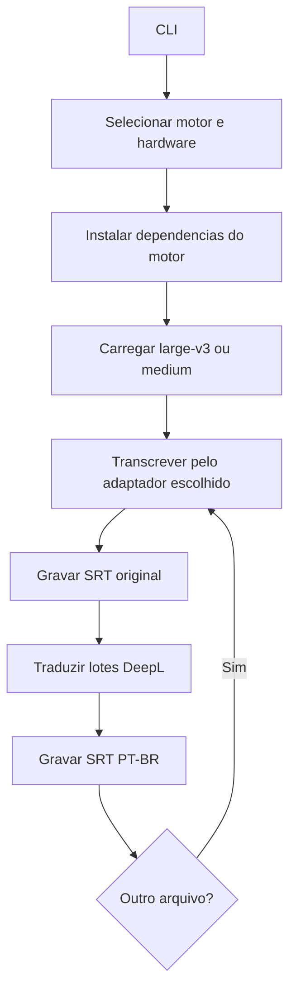

# Guia de manutencao

## Arquitetura

`gerar_srt.py` e apenas o entrypoint e uma fachada de compatibilidade. A aplicacao esta dividida por responsabilidade:

- `srt_generator/cli.py`: argumentos, menus, seletor de arquivos e composicao;
- `srt_generator/runtime.py`: dependencias, deteccao NVIDIA, CUDA e fallback CPU;
- `srt_generator/transcription.py`: adaptadores do faster-whisper e OpenAI Whisper legado;
- `srt_generator/translation.py`: cliente e lotes DeepL;
- `srt_generator/subtitles.py`: limite de palavras, timestamps e writer SRT;
- `srt_generator/media.py`: duracao da midia via PyAV;
- `srt_generator/ui.py`: paineis e tabela Rich;
- `srt_generator/pipeline.py`: ordem das quatro fases;
- `srt_generator/config.py`: resolucao da chave DeepL.



## Bootstrap e portabilidade

`ensure_dependencies()` instala somente `requests` e `rich`. Apos o primeiro menu, `ensure_transcription_dependencies()` instala o backend selecionado com o mesmo interpretador:

- `faster`: `faster-whisper==1.2.1`, que traz CTranslate2 e usa PyAV;
- `legacy`: `openai-whisper`, PyTorch, `imageio-ffmpeg` e `faster-whisper` para Silero VAD.

O menu retorna um par `(engine, preferred_mode)` para quatro perfis: faster GPU automatica, faster CPU, legado GPU e legado CPU. Via CLI, `--engine` e `--device` evitam o menu.

`configure_huggingface_downloads()` desativa o aviso de symlinks pela variavel oficial `HF_HUB_DISABLE_SYMLINKS_WARNING` e reduz o logger do Hub para `ERROR`. O modelo e publico e nao exige `HF_TOKEN`; excecoes reais de rede, cota ou disco continuam sendo propagadas.

`resolve_device()` retorna dispositivo, compute type e nome de exibicao:

- CPU: `cpu` e `int8`;
- NVIDIA: `cuda` e `int8_float16`.

No Windows, `try_install_nvidia_runtime()` tenta instalar cuBLAS CUDA 12 e cuDNN 9 pelos pacotes Python oficiais da NVIDIA e registra suas pastas `bin` no caminho de DLL da execucao. Um driver NVIDIA funcional continua sendo requisito externo. Falha de instalacao ou inicializacao nunca impede a execucao em CPU.

`configure_nvidia_dll_paths()` percorre todos os caminhos retornados por `site.getsitepackages()`, o site do usuario e tambem reutiliza `torch/lib` quando presente. Os objetos retornados por `os.add_dll_directory()` ficam vivos durante todo o processo; descartar esses handles remove o diretorio da busca de DLLs no Windows.

`FasterWhisperTranscriber` protege tanto o carregamento quanto o consumo do gerador lazy. Se cuBLAS, cuDNN ou CUDA falharem no primeiro `encode`, prepara o runtime, recria o modelo e tenta GPU uma vez. Se ainda falhar, reinicia a transcricao em CPU int8. O modelo e baixado para `%LOCALAPPDATA%/generate-srt/models` e reutilizado.

No motor legado, `ensure_legacy_torch_cuda()` tenta builds PyTorch `cu128`, `cu126` e `cu124`. Depois de trocar a build, reinicia o processo para que as DLLs CUDA sejam carregadas. `configure_legacy_ffmpeg()` disponibiliza o executavel do `imageio-ffmpeg` no `PATH` da execucao. Esse adaptador usa Silero VAD para montar `clip_timestamps` e processar somente intervalos com voz. Ele usa timestamps por segmento: ativar `word_timestamps` no Windows aciona os fallbacks DTW e mediana sem Triton e torna o processamento muito mais lento.

## Transcricao

O faster-whisper usa `large-v3` por padrao e o legado usa `medium`. Ambos recebem:

- idioma de origem explicito;
- `beam_size=5`;
- `condition_on_previous_text=False`;
- temperaturas `0.0`, `0.2` e `0.4`;
- limites de compressao, probabilidade, silencio e alucinacao.

O faster-whisper usa timestamps por palavra, Silero VAD e devolve um gerador lazy. Os blocos VAD possuem no maximo 15 segundos para preservar falas baixas que poderiam ser descartadas em janelas longas. `transcribe()` deve consumir o gerador para que o trabalho aconteca. Cada segmento e normalizado para dicionarios independentes da biblioteca e dividido quando o intervalo entre palavras supera 2,5 segundos. Fragmentos incompletos proximos sao reunidos antes da traducao, sem ultrapassar 7,5 segundos. Segmentos de ate duas palavras com probabilidade media inferior a `0.2` sao descartados como alucinacoes de baixa confianca. O progresso e calculado por `segment.end / info.duration`.

Antes de consumir o gerador, o adaptador compara `info.duration` com a maior duracao conhecida entre a faixa de audio e o conteiner. Se o decoder entregar menos de 90%, `recovered_audio_path()` usa FFmpeg com `aresample=async=1:first_pts=0` para criar um WAV mono 16 kHz temporario e repete a transcricao uma vez. Isso permite continuar apos pacotes AAC invalidos que encerram o decoder PyAV prematuramente.

`LegacyWhisperTranscriber` detecta voz antes da transcricao, converte os intervalos em `clip_timestamps` e nao chama o modelo quando nao ha fala. Ele preserva timestamps por segmento para evitar o fallback DTW lento no Windows e adapta temporariamente seu `tqdm` interno para o callback Rich. O objeto original e restaurado em `finally`.

O primeiro menu escolhe explicitamente o idioma de origem: `1` para ingles, `2` para espanhol e `3` para japones. O menu de motor vem depois e nao altera essa escolha. Ambos os adaptadores recebem o mesmo codigo de idioma, que tambem e usado como origem na chamada DeepL.

## Legendas

`split_segments_by_word_limit()` limita cada entrada a seis palavras e distribui os termos de forma balanceada entre os blocos, evitando divisoes como `6+1`. No faster-whisper, os segmentos ja sao recortados pela primeira e pela ultima palavra detectadas; a transcricao original tambem usa esses timestamps ao dividir entradas. Na traducao, reparte o intervalo proporcionalmente, pois a resposta DeepL nao possui alinhamento de audio.

`write_srt()` e interno e grava UTF-8 com timestamps `HH:MM:SS,mmm`. Assim, o writer nao depende de openai-whisper.

O original e sempre gravado antes da chamada DeepL. Uma falha de traducao preserva o resultado mais caro da transcricao.

## Traducao

`DeepLCloudTranslator` seleciona o endpoint Free para chaves `:fx` e o endpoint Pro para as demais. O destino `pt` vira `PT-BR`. As requisicoes usam contexto, `prefer_less`, `prefer_quality_optimized`, timeout de 30 segundos e autorizacao no cabecalho.

`translate_segments_strict()` limita lotes a 50 itens e cerca de 12.000 caracteres. HTTP 400, 403 e 456 nao sao retentados. Falhas transitórias recebem ate tres tentativas. O retorno deve manter quantidade, ordem e textos nao vazios.

A chave e procurada em `config.json`, depois `DEEPL_API_KEY` e por fim entrada oculta. O `config.json` e versionado por decisao do proprietario; uma chave publicada deve ser revogada no DeepL, pois removê-la depois nao apaga o historico Git.

## Testes

```powershell
python -m unittest -v
python -m py_compile gerar_srt.py srt_generator\*.py test_gerar_srt.py
git diff --check
```

Os testes unitarios nao baixam modelos nem consomem a API. Eles cobrem os quatro perfis, ambos os adaptadores e seus progressos, fallback CUDA, divisao temporal, contratos DeepL, erros sem retentativa e prioridade de configuracao.

Uma validacao integrada requer um arquivo curto, internet e chave DeepL. Execute com `--engine faster` e `--engine legacy`; quando disponivel, cubra CPU e CUDA.

## Alteracoes comuns

Para trocar o backend de transcricao, preserve a interface `transcribe(path, language, on_progress) -> list[dict]` usada pelo pipeline.

Para trocar o tradutor, preserve `translate_many(texts, context) -> list[str]`, mantendo tamanho e ordem. Erros de credencial e cota devem continuar explicitos.

Para mudar o limite de palavras, altere o padrao em `subtitles.py` e atualize os testes e documentos.

## Limitacoes

- Python e internet sao necessarios na primeira instalacao e no download do modelo.
- O script nao instala nem atualiza o driver NVIDIA.
- `large-v3` exige memoria e pode ser lento em CPUs modestas; `--model medium` reduz o custo.
- O Whisper antigo em CPU e consideravelmente mais lento e depende de uma API interna de progresso do pacote.
- A API DeepL requer internet, chave valida e cota.
- O seletor grafico depende do Tkinter incluído na instalacao Python.
- O idioma de origem e unico por execucao.

## Convencoes

- Manter Python 3.10 como versao minima enquanto for o ambiente principal.
- Nao importar bibliotecas pesadas no entrypoint antes de `ensure_dependencies()`.
- Nao registrar a chave DeepL nem inclui-la no corpo HTTP.
- Nao versionar midias, SRTs, caches ou ambientes virtuais.
- Fazer commit e push direto para `main` apos cada ajuste, incluindo todas as alteracoes presentes.
